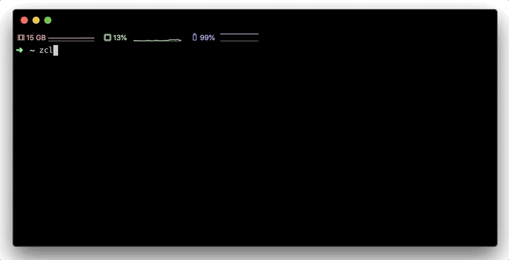

# ZCLI

[](https://www.npmjs.com/package/@zendesk/zcli)


ZCLI is a Zendesk CLI which helps you build and manage your Zendesk apps from the command line. ZCLI is currently available in beta and is built using the [oclif](https://github.com/oclif/oclif).



For more about ZCLI see [the full documentation.](/docs)

# Getting started

This is a [Node.js](https://nodejs.org/en/) module available through the [npm registry.](https://www.npmjs.com/package/@zendesk/zcli)

Before installing, download and install Node.js. Node.js 12.10 or higher is required. Installation is done using the npm install command:

```
$ npm install @zendesk/zcli -g
```

## Installation prerequisites for Linux

Currently ZCLI has a dependency on `libsecret` to save authentication information securely in the operating system's keychain.

Depending on your distribution, you will need to run one of the following commands prior to installing ZCLI:
- Debian/Ubuntu: `sudo apt-get install libsecret-1-dev`
- Red Hat-based: `sudo yum install libsecret-devel`
- Arch Linux: `sudo pacman -S libsecret`

## Note for Windows users running Linux on WSL

ZCLI's credential manager has a dependency on Linux's windowing manager (X11) which will make some commands fail to run on WSL, unless you run a setup of WSL with support for X11/GUI apps. These commands include: `zcli login`, `zcli logout` and `zcli profiles`.

There is a number of workarounds for this, but they are quite convoluted including:

* Manually starting a DBus session and unlocking the Gnome keyring with a password supplied via STDIN
* Using X11 forwarding to be able to enable the Gnome keyring prompt to display

A better approach might be to await the upcoming support for GUI apps in WSL2 that Microsoft is [working on](https://youtu.be/f8_nvJzuaSU) and that is currently in [Preview](https://docs.microsoft.com/en-us/windows/wsl/tutorials/gui-apps).

Features of ZCLI not dependent on ZCLI's credential manager should work in WSL2 w/o X11 support.

# Project structure

This is a monorepo project powered by lerna and yarn workspaces. It contains multiple packages:

- [packages/zcli](packages/zcli) contains base cli logic and core commands.
- [packages/zcli-core](packages/zcli-core) contains shared libraries and utilities.
- [packages/zcli-apps](packages/zcli-apps) contains all zendesk apps commands.

# Commands

ZCLI supports numerous commands. Further documentation on available commands can be found [here.](/docs)

- [`$ zcli apps`](/docs/apps.md) - manage zendesk apps workflow.
- [`$ zcli profiles`](/docs/profiles.md) - manage zcli profiles.
- [`$ zcli login`](/docs/login.md) - login to zendesk account.
- [`$ zcli logout`](/docs/logout.md) - logout and remove active profile.
- [`$ zcli autocomplete`](/docs/autocomplete.md) - display autocomplete installation instructions.
- [`$ zcli help`](/docs/help.md) - display help for zcli

# Developing

This is a monorepo project built using yarn and lerna workspaces. In order to set this up locally, run `yarn` after cloning this repository.

Running `yarn dev` or `./packages/zcli/bin/run` will run the cli locally. Alternatively, you can also run symlink your local CLI to global `zcli` binary by running `yarn run link:bin`.

# Project structure

This project contains multi product cli commands and contains packages per product. This is all powered using yarn workspaces and lerna. At the moment, this repo contains 3 packages.

1. [packages/zcli](/packages/zcli) contains all the core CLI code.
2. [packages/zcli-apps](/packages/zcli-apps) contains all the apps specific cli bits and is used in the core package as a plugin.
3. [packages/zcli-themes](/packages/zcli-themes) contains all the themes specific cli bits and is used in the core package as a plugin.

# Documentation

For a full reference, see the [documentation.](/docs)

# Releasing

Running the following command will create release tags, generate change logs docs and publish to npm.

[`$ ./scripts/release.sh`](./scripts/release.sh)

# Issues

You can [create an issue on Github](https://github.com/zendesk/zcli/issues/new), report the issue in the [Zendesk Developers Slack group](https://docs.google.com/forms/d/e/1FAIpQLScm_rDLWwzWnq6PpYWFOR_PwMaSBcaFft-1pYornQtBGAaiJA/viewform), or for other problems, [contact Zendesk Customer Support](https://support.zendesk.com/hc/en-us/articles/360026614173).

# License

Copyright 2021 Zendesk, Inc.

Licensed under the Apache License, Version 2.0 (the "License"); you may not use this file except in compliance with the License.
You may obtain a copy of the License at

http://www.apache.org/licenses/LICENSE-2.0

Unless required by applicable law or agreed to in writing, software distributed under the License is distributed on an "AS IS" BASIS, WITHOUT WARRANTIES OR CONDITIONS OF ANY KIND, either express or implied. See the License for the specific language governing permissions and limitations under the License.
